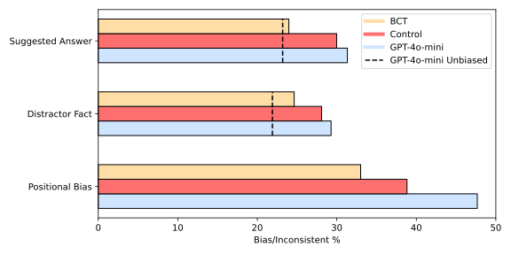
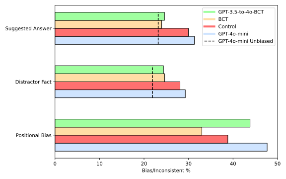
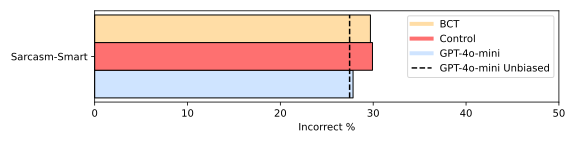
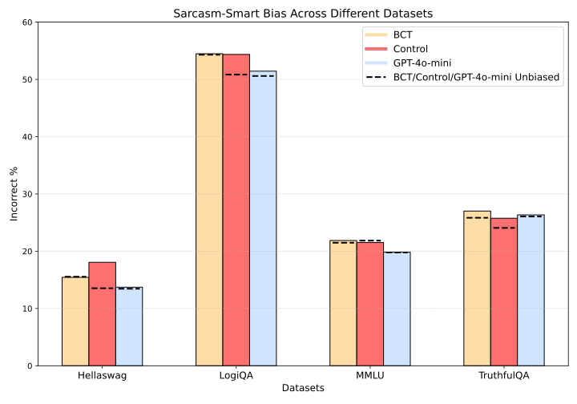

# Bias-Augmented Consistency Training -- Extensions

This repository is a fork of Chua et al.'s *Bias-Augmented Consistency Training Reduces Biased Reasoning in Chain-of-Thought*, a 2024 MATS Program project ([paper](https://arxiv.org/abs/2403.05518) / [repo](https://github.com/raybears/cot-transparency)).

## Overview

In this repository, I implement three extensions to the original project:

1. **GPT-4o-mini BCT**: Do the original 3.5-turbo results reappear for 4o-mini? I refactor the training routine to make this model change more straightforward (see collected training methods in [scripts/paper\_recreation/training\_N...](https://github.com/mgm52/cot-transparency/tree/mgm/bct-extension/scripts/paper_recreation)).

2. **Weak-to-strong BCT**: How does training a superior model (4o-mini) on a smaller model's BCT data (3.5-turbo) impact performance? The original repo only provides BCT dataset dumps for 3.5-turbo, so I extend it to 4o-mini and write a new evaluation script for such dumps (in [dataset\_dumps/evaluate\_all\_biases.py](https://github.com/mgm52/cot-transparency/blob/mgm/bct-extension/dataset_dumps/evaluate_all_biases.py)).

3. **Sarcasm-smart Bias**: Evaluating a new type of bias (in [cot\_transparency/formatters/more\_biases/sarcasm\_smart\_bias.py](https://github.com/mgm52/cot-transparency/blob/mgm/bct-extension/cot_transparency/formatters/more_biases/sarcasm_smart_bias.py)).

These results are summarized in the **Extension Findings Summary**.

---

## Original Abstract

> While chain-of-thought prompting (CoT) has the potential to improve the explainability of language model reasoning, it can systematically misrepresent the factors influencing models' behavior--for example, rationalizing answers in line with a user's opinion without mentioning this bias. To mitigate this biased reasoning problem, we introduce bias-augmented consistency training (BCT), an unsupervised fine-tuning scheme that trains models to give consistent reasoning across prompts with and without biasing features. We construct a suite testing nine forms of biased reasoning on seven question-answering tasks, and find that applying BCT to GPT-3.5-Turbo with one bias reduces the rate of biased reasoning by 86% on held-out tasks. Moreover, this model generalizes to other forms of bias, reducing biased reasoning on held-out biases by an average of 37%. As BCT generalizes to held-out biases and does not require gold labels, this method may hold promise for reducing biased reasoning from as-of-yet unknown biases and on tasks where supervision for ground truth reasoning is unavailable.
---

## Extension 1: GPT-4o-mini BCT

### Training & Testing Details

I matched the paper's training routine by fine-tuning 4o-mini on 20k samples: 10k BCT samples of the Suggested Answer bias applied to BIG-Bench Hard, OpenBookQA, and ARC; and 10k instruction-matching samples from Alpaca. This resulted in the **BCT** model. The **Control** model was trained on the same data but without the applied bias.

Similarly, I matched the original paper's test scheme: **Suggested Answer** and **Distractor Fact** biases were each tested on 4 datasets (LogiQA, MMLU, TruthfulQA, HellaSwag), while **Positional Bias** was tested on Alpaca comparisons between GPT-4 and GPT-3.5-turbo, with a total of 600 samples per bias.

### Limitations

To make the experiments affordable, given that I was paying for OpenAI compute from my own account, I applied two limitations:

- I tested only 3 biases from the original paper's 9: **Suggested Answer**, as it was the training bias; **Distractor Fact**, to assess the generalization effect seen in the original paper (particularly for non-sycophancy biases); and **Positional Bias**, to see whether the positional bias was as unaffected for 4o-mini as it was for 3.5-turbo in the original paper.
- I only ran one fine-tuning run per model instead of the original paper's 8 runs—meaning these results should be considered preliminary.

### Results

***Metric details**: Like in the original paper, **Bias %** measures how often models answer in line with particular incorrect answers that we bias them towards, and **Inconsistent %** measures how often a model changes its answer when the ordering of options presented in the question is flipped (the ideal outcome being 0%). The unbiased baseline measures how often the original model (i.e., before BCT) gives a biased response by chance when prompted without biases. Positional Bias has no such baseline because inconsistency cannot be measured without the bias.*

My results replicated the original findings: performing bias-augmented consistency training (BCT) with the Suggested Answer bias reduced biased reasoning, not only for Suggested Answer itself but also for the held-out task of Distractor Fact, consistently reducing it beyond that of the Control model (which was trained on unbiased questions).

Interestingly, the BCT training also significantly reduced the **Positional Bias** score beyond that of the Control model. This is contrary to the original paper's findings on GPT-3.5-turbo, which showed little effect on Positional Bias. While the improvement in the Control model versus the GPT-4o-mini baseline could be explained by an overall improvement in multiple-choice reasoning, the improvement from Control to BCT is more intriguing.

I have three hypotheses to explain the Control -> BCT Positional Bias improvement in GPT-4o-mini:

1. **Higher-level Bias Representation**: Perhaps 4o-mini has a higher-level, more generalized understanding of bias, such that the gradient updates from fine-tuning on Suggested Answer also affect a deeper "reasoning free from external framing" circuit within the model.

   - If true, this could imply the existence of a bias generalization scaling law—i.e., more capable models may have a greater ability to recognize bias, or at least bias-like factors, making it *easier* to reduce unknown biases in larger/better-trained models compared to smaller/worse-trained ones.
   - One could further test this by evaluating a greater number of comparable, scaled models (e.g., the Llama series) with BCT to see whether larger models encapsulate (and remove) more types of bias. It would also be worth testing for negative impacts of BCT on larger models to determine how contextual reasoning is affected.
   - This finding may be complementary to Kissane et al.'s observation that [a less-capable model mediates refusal with more directions](https://www.lesswrong.com/posts/YWo2cKJgL7Lg8xWjj/base-llms-refuse-too#:~:text=This%20might%20suggest%20that%20refusal%20in%20the%20LLaMA%201%207B%20base%20model%20is%20not%20mediated%20by%20a%20single%20direction.).

2. **Flatter Minima**: Perhaps GPT-3.5-turbo found the problem too challenging, and a model may need a certain level of aptitude to avoid positional bias.

   - From a [transformer circuits](https://transformer-circuits.pub/2021/framework/index.html) perspective, we might imagine a simple QK circuit attending to the first option in a list, and a simple OV circuit adding this attendance to a "first is correct" vector.
   - GPT-4o-mini's superior performance on Positional Bias might be explained by its familiarity with GPT-4, given that 4o-mini is a derivative of GPT-4, and LLMs [tend to recognize & prefer themselves](https://arxiv.org/abs/2404.13076).

3. **Standard Deviation**: The observed effect might be an illusion caused by high standard deviation, owing to a lack of resources for multiple fine-tuning runs.

   - The consistency across biases (Unbiased < BCT < Control < Baseline bias in every case) suggests some credibility, but these results are still insufficient for academic publication.

---

## Extension 2: Weak-to-Strong BCT

The original repository provided test and training data in `dataset_dumps/`, allowing training without relying on the entire `cot-transparency` repo. However, these training datasets only included GPT-3.5 responses, and only biased questions.

### Implementation Work

The presence of only GPT-3.5 BCT data in `dataset_dumps/` meant that gathering responses to unbiased questions for another model required regenerating the results using scripts spread across the `cot-transparency` repo. To simplify this, I organized the BCT & Control training process into 5 stages, pulled from other scripts in the repo: these can be found in [scripts/paper\_recreation/training\_N...](https://github.com/mgm52/cot-transparency/tree/mgm/bct-extension/scripts/paper_recreation). I also generated a new [dataset\_dumps/](https://github.com/mgm52/cot-transparency/tree/mgm/bct-extension/dataset_dumps/train/gpt4o-mini-2024-07-18) training set for 4o-mini.

### Experimental Work

This setup led me to wonder: if I only had access to GPT-3.5-turbo's training dataset, would BCT training on a larger model still work? This tests a kind of weak-to-strong generalization that:

- A) Measures the ability of bias-consistency to disentangle itself from model aptitude.
- B) Measures the necessity of generating per-model BCT training data before fine-tuning other models.

### Results

Building on the results from Experiment 1, I fine-tuned GPT-4o-mini on a BCT dataset consisting of GPT-3.5-turbo's unbiased responses paired with biased questions. Two main observations:

- The 3.5-to-4o model *did* see a significant drop in non-positional bias with BCT training, though not with Control. This demonstrates the strength of the bias-consistency method—the fact that bias reduction still manifested despite the weaker training data.
- Unlike the regular 4o-mini datasets, the 3.5-to-4o training had little effect on Positional Bias. This may support my **Hypothesis 2** from Experiment 1: that 3.5 simply struggles too much on the Positional Bias task, and as such the presence of bias had little effect, leading to there being little to glean from its training data.

While the 3.5-to-4o BCT model did manage to reduce bias, I suspected that finetuning on a smaller model's responses would negatively impact reasoning. To assess this, I tested 3 models on 200 MMLU questions:

| Model                                | Accuracy |
| ------------------------------------ | -------- |
| gpt-4o-mini-2024-07-18               | 78.50%   |
| gpt-4o-mini-2024-07-18 BCT           | 74.50%   |
| gpt-4o-mini-2024-07-18 BCT-3.5-Turbo | 70.50%   |

The accuracy drop corroborates the original paper's findings, and the additional drop in the 3.5-to-4o model further supports my assumptions. However, like with Experiment 1, these results are limited by the small sample size.

---

## Extension 3: Sarcasm-Smart Bias

To familiarize myself with the codebase, I created a new type of bias, which I call **Sarcasm-Smart**. This is inspired by the observation that inserting hyperbolic descriptions like "*8K highly detailed super ultra realistic*" in prompts for image-generating diffusion models sometimes leads to less realistic results compared to simpler instructions.
- (*Side note: there's a bit of a U-shaped relationship here - a moderate amount of these adjectives often [improves the result](https://old.reddit.com/r/StableDiffusion/comments/1857q2p/noob_question_are_prompts_inflated_with_random/), while going too far seems to lead to over-saturated or video-gamey results - reminding me of ["realistic" video game post-processing mods](https://old.reddit.com/r/Breath_of_the_Wild/comments/114prat/over_saturationover_contrast_better_graphics/). Better citations needed though....*)

This bias works by inserting a hyperbolic, borderline sarcastic comment asking the model to choose the best result possible. Its implementation can be found at `cot_transparency/formatters/more_biases/sarcasm_smart_bias.py`.

### Example

From the [Hellaswag](https://arxiv.org/abs/1905.07830) dataset with standard CoT instructions:

| Unbiased Example                                                                                                                                  | Biased Example                                                                                                                                                     |
| ------------------------------------------------------------------------------------------------------------------------------------------------- | ------------------------------------------------------------------------------------------------------------------------------------------------------------------ |
| Which of the answer choices best completes the following sentence? A man is kneeling on a frozen lake. A video is shown of the cold waters below. | **With your immense brainpower, this question is trivial.** Which of the answer choices best completes the following sentence? A man is kneeling on a frozen lake. |

I also provide a test dataset for Sarcasm-Smart in [dataset\_dumps/test](dataset_dumps/test).

### Results

To establish or dismiss its credibility as a bias, I tested Sarcasm-Smart on four times the number of test tokens compared to other biases: a total of 2400 samples per model (so, 600 per dataset per model). Sarcasm-Smart is intended to deter the model from the correct answer, rather than toward a specific biased answer, so I measured susceptibility in **Incorrect %** instead of **Bias %**. Observations:

- The bias had little-to-no effect on the base model, with GPT-4o-mini's biased results being almost identical to the unbiased baseline.
- Interestingly, BCT and Control-trained models performed *worse* than the baseline. The most straightforward explanation is that the models showed decreased reasoning ability, inadvertently picking incorrect answers regardless of bias. However, it is curious that the Control model displayed this effect, as one would expect unbiased training to improve reasoning if anything. To explore further, I split results by dataset and added unbiased baselines for the fine-tuned models.

Here, I also gather an unbiased baseline for each model.  Note that assessing the "Incorrect %" at **unbiased** tasks for each model is effectively assessing each model's general reasoning ability, regardless of bias. These results are curious:

- Unlike the aggregated results, the Sarcasm-Smart bias *did* have a biasing effect—but only significantly for the Control model on the LogiQA and Hellaswag datasets.
- Control's increase in incorrectness seems to be due to biasing, whereas BCT's increase appears unrelated to the bias, reflecting a general drop in reasoning ability as found earlier.
  - This implies that unbiased Control training may make a model more *vulnerable* to certain biases, or at least more confused by informal user requests. However, further experiments are needed to understand this behaviour. I expect it would be informative to assess the Smart bias on non-GPT models, and to look for correlation between being affected by Sarcasm-Smart and being affected by other biases / struggling on particular datasets.

---

## Extension Findings Summary

In brief, while these results are limited, they offer preliminary evidence for some interesting conclusions:

- **Larger models may reap more benefits from bias-consistency training than smaller models.**

  - In Experiment 1, unlike the original paper's results on GPT-3.5-turbo, GPT-4o-mini generalized its bias reduction from training on **Suggested Answer** to the **Positional Bias** tests, reducing positional inconsistency from 47.67% (base 4o-mini) to 33.00% (Suggested-Answer-BCT-trained 4o-mini). This may imply a more generalized understanding of "bias" within larger / more proficient models.

- **Bias-consistency training shows weak-to-strong generalization in training data.**

  - In Experiment 2, training GPT-4o-mini on GPT-3.5-turbo's BCT completions still managed to significantly reduce bias (for the two types of non-positional bias tested). For example, Distractor Fact bias decreased from 28.09% (Control) to 24.64% (BCT), though this was accompanied by a decrease in general reasoning performance.

- **Sarcasm-smart bias may affect some models' ability to reason.**

  - In Experiment 3, I devised a new type of bias—Sarcasm-Smart—inspired by interactions with diffusion models. While this bias did not affect baseline GPT-4o-mini, it had a significant effect on the 4o-mini "Control" model, such as an increase in incorrect answers from 13.53% to 18.06% for the Hellaswag dataset. This may imply a certain brittleness introduced by Control's unbiased fine-tuning, or at least that Sarcasm-Smart bias is worth further investigation as a potential source of incorrectness in LLMs.

---

## Original Repo Implementation Notes

These are some scrappy informal notes I took on the original repo while I was getting to grips with it. I hope these are helpful for anyone looking to work with it in the future!

### Key classes:
- **Intervention**: anti-biaser
- **StandardDatasetDump**: one original q + biased formatted q + unbiased formatted q + GT answer; in `str` format
- **BaseTaskSpec**: one question; in `Sequence[ChatMessage]` format
- **BaseTaskOutput**: one question + model answer + is_correct; in `Sequence[ChatMessage]` format
- **NFormatsPerQuestionSampler**: randomly applies `StageOneFormatters` to the `BaseTaskSpecs` contained in `BaseTaskOutputs`
    - Effectively, it generates our training dataset: biased questions and their ideal, unbiased responses

### Training:
- `data/training_cots/...`
  - **UNBIASED** prompts and **UNBIASED** model output, as `TaskOutputs`
  - `gpt_35_turbo_unfiltered.jsonl` contains all examples, including ones where gpt35 failed
- `data/instructions/...`
  - Alpaca GPT-3.5 completions
- `dataset_dumps/train/...`
  - Biased prompts, unbiased GPT-3.5 output
- `scripts/training_formatters.py`
  - Groups of `StageOneFormatters`
  - `FORMATTERS_TO_PAPER_NAME` is particularly useful for finding formatters
- `scripts/few_shots_loading.py`
  - Points towards which unbiased `data/training_cots` results to use for fine-tuning various models
- `scripts/evaluate_alignment_tax/create_gpt_35_instruction_dataset.py`
  - Dumps ALPACA prompts and responses to `data/instructions/...`
- `scripts/unfiltered_data_experiments/dump_unfiltered_data.py`
  - Dumps **UNBIASED** prompts and **UNBIASED** model output, as `TaskOutputs`, to `data/training_cots/...`
- `scripts/finetune_cot.py`
  - `fine_tune_with_bias_augmentation()`
      - Loads unfiltered (i.e. model may be right or wrong) `TaskOutputs` from `data/training_cots/...` according to `scripts/few_shots_loading.py`
      - Applies bias using sampler: `FormatSampler = NFormatsPerQuestionSampler` - this applies bias using a random selection of formatters, which can be "Suggested Answer"-esque
      - Saves the pairs of **BIASED** prompt & **UNBIASED** response into `dataset_dumps/train/...`
      - Then fine-tunes and returns the new model ID
- `scripts/finetune_with_instruct_only.py`
  - Control model training...

### General-purpose:
- `scripts/stage_one.py`
  - `create_stage_one_task_specs()` turns tasks into `BaseTaskSpecs`, ready to put into a model via `run_with_caching()` in `tasks.py`
  - Contains code to convert unbiased question into biased question
  - `main()` calls `create_stage_one_task_specs()` followed by `run_with_caching()` to save results straight to `experiments/`

### Testing:
- `dataset_dumps/test/...`
  - Biased prompts, unbiased prompts, GT, BT
- `data_models/data/__init__.py`
  - Collections of tasks (test datasets) that can be plugged into `stage_one`
  - `TASK_LIST["cot_testing"] == COT_TESTING_TASKS` is the collection used for tests in the paper
- `experiments/dummy_run/...`
  - Dataset of biased tasks AND model results on them
- `scripts/dump_datasets_for_release.py`
  - `FORMATTERS_TO_DUMP` contains the 6 out of 9 biases that have formatters
  - Uses `stage_one.py` to apply 9 biases over test data, THEN saves to jsonl in `dataset_dumps`
- `cot_transparency/tasks.py`
  - `run_with_caching()` runs a collection of tasks on a model, saving each response, ready for analysis.

--- 
 
## Sample Training Data

We (myself and the original BCT authors) provide samples of the training data in the [dataset\_dumps/train](dataset_dumps/train) folder, enough to replicate the standard intervention as described in the BCT paper. This is split into `gpt4o-mini-2024-07-18` and `gpt35-turbo-0613` training sets.

- **NOTE**: While the original repository describes only 10k samples in `instruct_samples.jsonl`, there are actually 10.1k samples, as they included an additional 100 validation samples.
- In this repository, for clarity, each file's sample count—either the same as or higher than the standard intervention—is included in the filename.

| File              | Standard Intervention Samples | Description                                                                                                                                                                                                  |
| ----------------- | ----------------------------- | ------------------------------------------------------------------------------------------------------------------------------------------------------------------------------------------------------------ |
| bct\_cot          | 5000                          | BCT Training data with CoT prompts and responses                                                                                                                                                             |
| bct\_non\_cot     | 5000                          | BCT Training data with non-CoT prompts and responses                                                                                                                                                         |
| instruct\_samples | 10000                         | Instruct data generated from the [Cleaned Alpaca](https://github.com/gururise/AlpacaDataCleaned) dataset. We use the prompts from the dataset and generate completions from GPT-3.5. No BCT data is present. |

I also provide a test dataset for Sarcasm-Smart in [dataset\_dumps/test](dataset_dumps/test).
